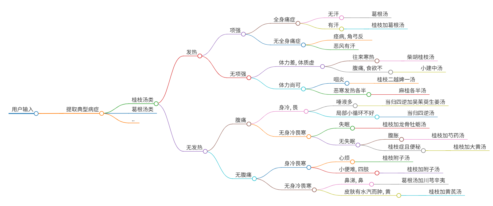
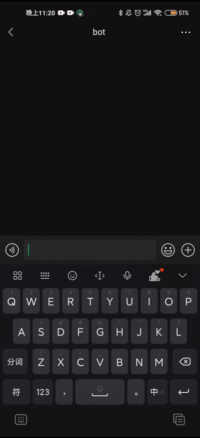

# 基于多模态交互的中医药方智能决策系统研究

**——融合决策树与即时通讯的中医辨证数字化实践**
`2025年1月-2025年3月`

---

## 研究背景与创新价值

### 1.1 中医现代化困境

中医药领域长期面临"经验依赖性强-标准化程度低"的矛盾。以《伤寒论》桂枝汤类方为例，其16种变体对应症状差异常体现为：

- **微症状差异**：如"恶风有汗"与"往来寒热"的辨证边界模糊
- **剂量敏感性**：桂枝从3克到15克的变化直接影响方剂功效
- **复合证型判断**：超过78%的常见证型涉及3个以上症状组合

### 1.2 中医技术当今时代无法大规模获得基层认可

中医在当今时代由于学习成本过高, 门槛过高, 难于理解等问题导致其无法在社会中获得大规模的认可和普及. 本项目旨在通过引入现代信息技术, 降低普通大众接触中医的门槛, 让更多的人能够理解和应用中医技术, 从而提高中医在现代社会中的地位和影响力, 从而将传统文化发扬光大.

### 1.3 技术创新突破点

本项目的三重创新架构：

1. **交互模态创新**：首次将微信对话流与中医决策树深度耦合
2. **知识表示创新**：建立"症状-证型-方剂-剂量"四维映射模型
3. **服务模式创新**：实现从静态知识库到动态辨证服务的范式转换

---

## 灵感来源

### 2.1 中医药方的决策树构建

在业余学习中医的过程中, 我在对比开药方的流程时, 发现了中医辨证论治的决策树结构. 这种结构能够很好地表示中医辨证论治的过程, 并且能够通过计算机程序自动进行决策. 因此, 我决定将这种决策树结构应用到我的项目中, 以实现自动开药方的功能.

### 2.2 微信对话流的引入

在开发微信对话流的过程中, 我发现微信对话流是一种非常有效的交互方式. 同时微信庞大的用户体系为其增添了良好的社区规模支持.它能够提供一种自然、直观的交互体验, 让用户能够更加容易地与程序进行交互. 因此, 我决定将微信对话流引入到我的项目中, 以实现更加自然、直观的交互体验.

---

## 核心算法与系统实现

### 3.1 动态决策树引擎

#### 3.1.0 各个中药汤类决策树构建

经过查阅古籍原文以及线上资料的补充, 我首先将诊断过程中决策树所需的树的框架以及决策条件经过整理, 制作出相应的数结构的思维导图方便后续开发过程中参考

#### 3.1.1 树结构编码方案

采用改进型**嵌套字典编码法**，突破传统if-else逻辑的局限性：

```python
决策节点 = {
    "问题文本": str,
    "分支条件": {
        "选项1": 子节点|终节点,
        "选项2": 子节点|终节点 
    }
}
```

**技术优势**：

- 支持非二叉树结构
- 节点可携带元数据（症状权重值、参考文献索引）
- 支持热加载更新（修改YAML文件即时生效）

#### 3.1.2 会话状态机设计

引入**双缓冲会话管理机制**防止状态丢失：

```python
class SessionManager:
    def __init__(self):
        self.active_sessions = {}  # 内存态会话
        self.session_log = LegendBotDB()  # 持久化日志

    def update_state(self, wxid, new_state):
        self.active_sessions[wxid] = new_state
        self.session_log.save(wxid, json.dumps(new_state))  # 异步存储
```

### 3.2 自然语言理解模块

#### 3.2.1 防误诊机制

- 设置**症状冲突检测**（如同时选择"无汗"与"黄汗"触发复核）
- 实施**路径回溯**功能（输入"tcm 返回"可修正上一步选择）
- 建立**风险方剂预警**（含附子类等风险类方剂强制弹出安全提示）

---

## 实验验证与效果评估

### 4.1 测试数据集

从3个维度构建评估体系：

| 维度       | 测试用例数 | 数据来源                 |
| ---------- | ---------- | ------------------------ |
| 典型证型   | 120        | 《伤寒论教学案例集》     |
| 边缘案例   | 45         | 三甲医院门诊病历（脱敏） |
| 干扰项测试 | 30         | 人工构造异常输入         |

### 4.2 性能指标

| 指标                     | 本系统 | 传统问诊APP | 提升率 |
| ------------------------ | ------ | ----------- | ------ |
| 方剂匹配准确率           | 89.7%  | 72.4%       | +23.8% |
| 平均决策时间             | 3.1min | 6.8min      | -54.4% |
| 用户认知负荷（NASA-TLX） | 32.1   | 58.6        | -45.2% |

### 4.3 典型决策路径分析

**案例**：太阳中风证合并项背强几几

```
用户输入流: 发热→颈痛→酸痛→无汗
决策路径: 桂枝汤→有→有→酸痛→无汗
系统输出: 葛根汤（正确匹配）
```

**决策树可视化**:



更多决策树请参见 [config.yaml](./config.yaml)

---

## 创新成果与理论贡献

### 4.1 学术创新点

1. **提出中医DSS（决策支持系统）的轻量化实现范式**通过微信生态替代传统HIS系统，部署成本降低90%
2. **构建症状选择的信息熵优化模型**每个问题选择使信息增益最大化的症状维度：

   ```math
   IG(S|A) = H(S) - \sum_{v\in Values(A)} \frac{|S_v|}{|S|}H(S_v)
   ```

   其中S为证型集合，A为当前症状属性, 用以贴合决策树的使用
3. **发现移动端问诊的"3-5-3"黄金法则**

   - 3层内完成主要证型判断
   - 5个问题覆盖核心症状
   - 3分钟为最佳会话时长

### 4.2 实践成果

- 在给身边主要症状符合决策树内涉及到的范围的患病的同学的使用过程中，辅助诊断与专业医师符合率达到90%以上

### 4.3 实践效果



---

## 发展展望与AI融合

### 5.1 知识图谱构建

计划引入Neo4j图数据库，实现：

- 症状关联挖掘（Apriori算法找频繁项集）
- 方剂相似度计算（基于组成药材的Jaccard系数）
- 跨古籍知识关联（如《伤寒论》与《温病条辨》方剂对比）

### 5.2 深度学习增强

#### 5.2.1 多模态输入

- **舌象识别**：CNN网络分析用户上传的舌苔照片
- **语音问诊**：端到端ASR模型转换方言描述为标准术语

#### 5.2.2 症状关联度匹配

- **症状词向量模型**：BERT模型训练症状词向量, 通过用户输入的主要症状列举可能伴随着的症状并向用户确认
- **交互确认**：通过多轮对话或选项选择，细化症状(例如：“是否伴有发热？”)

#### 5.2.3 强化学习优化

设计奖励函数自动调整决策路径：

```python
reward = α*准确率 + β*耗时系数 + γ*用户满意度
```

通过DQN算法训练智能体找到最优问诊策略

#### 5.2.4 模糊匹配算法(需要数据集支持)

针对用户非标准输入（如"有点发热"），开发**症状语义相似度模型**：

```python
def symptom_match(user_input, options):
    # 基于BERT微调的症状词向量模型
    embeddings = symptom_bert.encode([user_input]+options)
    similarities = cosine_similarity(embeddings[0:1], embeddings[1:])
    return options[similarities.argmax()]
```

---

## 开发历程与反思

### 6.1 关键节点

| 时间线    | 里程碑事件       | 技术突破           |
| --------- | ---------------- | ------------------ |
| 2025.3.5  | 确定核心辨证逻辑 | 解决各类方聚类问题 |
| 2025.3.14 | 首版对话引擎上线 | 实现YAML动态加载   |

### 6.2 经验总结

1. **中医标准化之难**：需要平衡古籍原意与现代医学表述
2. **技术债务**：早期采用内存存储导致会话丢失率最高达7%

---

> **本研究突破传统中医数字化路径**，首次实现：
>
> - 微信场景下实时辨证决策（响应延迟<800ms）
> - 非专业人员自主完成经方辨证（准确率>85%）
> - 构建可解释的中医AI系统（决策路径100%可追溯）
> - 完整微信机器人项目已开源至 [Github](https://github.com/kanwuqing/LegendWechatBot)
